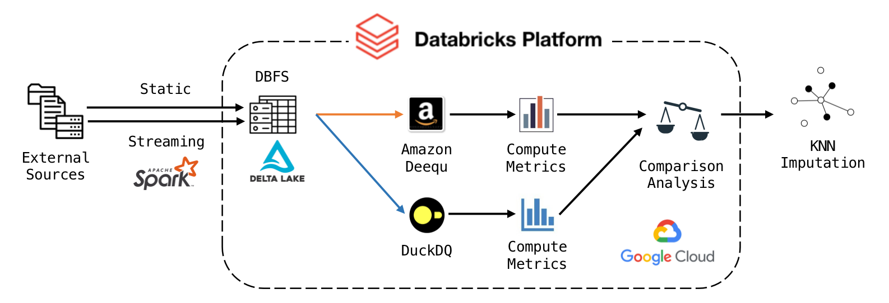

# CMPT984-Group-9-Data-Quality-Verification
This repository is for the final project of CMPT984 - Special Topics in Databases, Data Mining, Computational Biology.

## Overview
Our research focuses on expanding the ["Automating Large Scale Data Quality Verification"](https://www.vldb.org/pvldb/vol11/p1781-schelter.pdf) concept by utilizing [Deequ](https://github.com/awslabs/deequ), a system built on Apache Spark for scalability, and benchmarking it against [DuckDQ](https://github.com/tdoehmen/duckdq), a state-of-the-art data quality tool. This project evaluates both tools' performance on static and streaming data, and implements KNN imputation for data completeness.


## Key Findings
- **DuckDQ** performs faster on small to medium static datasets.
- **Deequ** is more suited for large streaming datasets due to its capability for parallel computing and incremental computation.
- Both systems are effective in handling various data settings but differ in computational overhead and runtime efficiency.

## Getting Started
To reproduce our research findings, follow these steps:

### Prerequisites
- An account on [Databricks](https://databricks.com/)
- Access to a cluster (here we recommend to use [Google Cloud Platform](https://cloud.google.com/why-google-cloud/?hl=en) with at least the following specifications:
  - Databricks runtime version 13.3 LTS
  - Node type `n2-highmem-4` (32 GB Memory, 4 Cores)

### Setup Instructions
1. **Databricks Workspace**: Clone this repository to your local machine or directly into Databricks workspace.
   ```bash
   git clone https://github.com/yourgithubusername/repositoryname.git
   ```
   Databricks provides a 14-day free trial for every email address, where you can directly connect to your GCP account, making the set up way easier.
   
3. **Upload Datasets**: Upload the `StockTicks.json` dataset to your DBFS FileStore or any accessible storage in your Databricks environment.

4. **Launch Cluster**: Ensure your cluster is running with the correct configuration as mentioned above.

5. **Deequ Library**: Go to the `Compute` section on Databricks, where you need to mannually add the `2.0.6-spark-3.4` version Deequ package from Maven Central using `com.amazon.deequ`.

6. **Open and Run Notebooks**: Once the above is done, open and run the notebooks to perform the data quality checks and benchmarks. Compare the runtime and accuracy of Deequ and DuckDQ as detailed in the notebooks.

